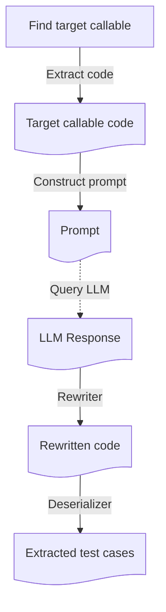

```mermaid
flowchart TD
    A[Find target callable] -->|Extract code| B@{ shape: doc, label: "Target callable code" } -->|Construct  prompt| C@{ shape: doc, label: "Prompt" } -.->|Query LLM| D@{ shape: doc, label: "LLM Response" } -->|Rewriter| E@{ shape: doc, label: "Rewritten code" } -->|Deserializer| F@{ shape: doc, label: "Extracted test cases" }
```